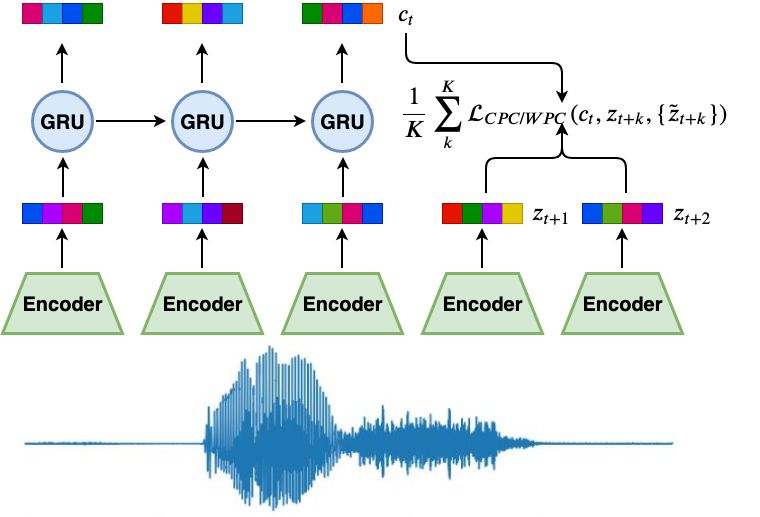

# Representation learning by predictive coding

This repository provides codes reproducing two papers, "[Representation learning by contrastive predictive coding](https://arxiv.org/abs/1807.03748)" and "[Wasserstein dependency measure for representation learning](https://arxiv.org/abs/1903.11780)". 

This personal project aims to show
* Successful implementation and comparison of self-supervised learning by contrastive/Wasserstein predictive coding. 
* Comparison of the classification accuracy of supervised learning and semi-supervised learning results. 
* Comparison of the methods enforcing 1-Lipschitz continuity: spectral normalization and gradient penalty methods. 

## Methodology

As shown in the above figure,

* a set of speech data is given to the model. The window size of the inputs is 20480(=128x160). 

* Then, the convolutional encoder and the GRU-RNN blocks produce  and , respectively. 

* As described in the paper, the convolutional encoder is composed of five convolutional layers with strides=\[5,4,2,2,2\], filter_size=\[10,8,4,4,4\] and output dimension=512. Therefore, the down-sampling factor of this encoder is 160(=5x4x2x2x2), and thus the ouput with shape \[batch_size, 128, 512\] (corresponds to a set of ) will be obtained.

* The GRU-RNN sequentially reads  and outputs . 

* To summarize, we can understand that  is a local vector contains the local information of the sensory inputs with window size 160, and  is a vector contains the global information.

* This model aims to learn both local and global representations (latent vectors) by minimizing so-called the infoNCE loss . 

* The idea is to predict the local representation vector of the k-th future step  with the global representation vector , by distinguishing the positive sample  from the negative samples . 

* In order to implement the infoNCE loss, the negative sample can be obtained by the shuffling  along to the batch axis. 

## Results

*Placeholder -- will be updated as soon as possible*

## To do plans

* Supervised learning of speaker and gender classifications 
* Pre-training baseline models by self-supervised learning
* Fine-tuning the pre-trained networks on the down-stream tasks.
* Applying the methods to the other domain data, such as medical data.

